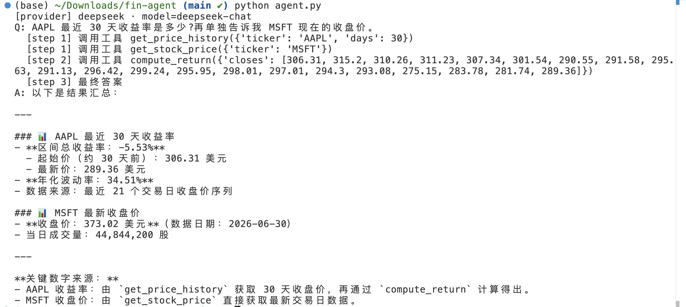

# Finance Agent — 金融数据问答 Agent
 
一个最小但闭环完整的单 Agent：用户用自然语言提问（股票表现、收益率、波动率、两只股票对比），
Agent 自主决定调用哪些工具、多步执行、并给出带来源的答案。
 
支持 **DeepSeek / OpenAI 一键切换**（改一个环境变量，代码零改动）。
 
> 目标不是"功能多"，而是把 **provider 抽象、agent loop、tool-calling、多步/并行工具编排、失败兜底、评测** 这几件事做清楚。
 
## Demo


## 架构
 
```
用户问题
   │
   ▼
┌─────────────────────────────────────────┐
│  Agent Loop (agent.py)                   │
│  循环：LLM 决策 → 调工具 → 结果回灌 → 再决策 │
│  · function-calling 让 LLM 结构化地"点名"工具 │
│  · 支持并行调用（互不依赖的工具）+ 串行依赖    │
│  · max_steps 上限，保证 loop 一定终止        │
│  · LLM 调用失败自动重试                      │
└──────┬───────────────────────┬───────────┘
       │ 工具名+参数            │ 供应商配置
       ▼                       ▼
┌──────────────┐      ┌──────────────────────┐
│ 工具层 tools  │      │ config.py            │
│ 4 个金融工具  │      │ DeepSeek ⇄ OpenAI 切换 │
│ 函数 + schema │      │ (OpenAI-compatible)  │
└──────────────┘      └──────────────────────┘
```
 
## 工具（4 个）
 
| 工具 | 作用 |
|------|------|
| `get_stock_price` | 取某股票最近交易日收盘价、成交量 |
| `get_price_history` | 取最近 N 个交易日收盘价序列 |
| `compute_return` | 给定收盘价序列，算区间收益率与年化波动率 |
| `compare_stocks` | 对比两只股票的收益率，并算日收益相关系数（分散化分析）|
 
## 一次复合问题：并行 + 串行编排
 
问：*"AAPL 最近 30 天收益率是多少？再单独告诉我 MSFT 现在的收盘价。"*
 
```
[step 1] get_price_history(AAPL, 30)   ┐ 互不依赖，
[step 1] get_stock_price(MSFT)         ┘ 并行发起
[step 2] compute_return(closes=[...])    ← 依赖 step1 的 AAPL 数据，串行等待
[step 3] 最终答案（含数据来源与真实交易日数说明）
```
 
Agent 自主把问题拆成独立子任务与依赖子任务：互不依赖的取数并行发起，
有数据依赖的计算步骤串行等待——体现 loop 的动态规划能力，而非固定流程。
 
## 关键设计决策（面试可展开）
 
- **Provider 抽象**：DeepSeek API 与 OpenAI 兼容，用同一 SDK，只切 base_url + model + key；
  换供应商 = 改一个环境变量。
- **为什么手写 loop 而不用重框架**：几十行讲清 agent 本质（决策—执行—回灌—终止），
  比黑盒框架更能体现对机制的理解。
- **工具粒度设计**：`compare_stocks` 把"取两只股票→对齐→算相关"封装成一个工具，
  Agent 面对对比类问题时能一步命中，而非笨拙地多次取数再自己算。
- **怎么保证 loop 终止**：`max_steps` 硬上限；达到上限明确降级返回，而不是硬编答案。
- **工具结果如何回灌**：作为 `role="tool"` 消息（带 `tool_call_id`）追加进对话历史，
  让 LLM 下一轮据此决策；对话历史即多步状态。
- **真实数据鲁棒性**：`compare_stocks` 用 `min(len_a, len_b)` 处理两只股票交易日不对齐；
  "30 自然日→21 交易日"等情况在答案中如实说明。
- **容错**：工具异常在 `run_tool` 兜底成 `{"error": ...}` 回灌，LLM 可换策略；LLM 调用本身带重试。
- **评测**：`eval.py` 用测试问题批量跑，检查是否命中预期，输出通过率——让"能跑"变成"可衡量"。
## 已知局限 / 下一步（诚实清单）
 
- 评测是宽松的关键词命中检查，非严格数值断言；下一步可加 LLM-as-judge。
- 单 agent、单轮问答，无持久化记忆；下一步可加会话记忆与结果缓存。
- 工具依赖 yfinance 免费数据，未做限流/重试缓存。
## 运行
 
```bash
python -m venv venv && source venv/bin/activate     # Windows: venv\Scripts\activate
pip install -r requirements.txt
 
cp .env.example .env                                 # 填入key
export $(cat .env | grep -v '^#' | xargs)            # 载入环境变量（Mac/Linux）
 
python agent.py     # 跑示例问题
python eval.py      # 跑评测，看通过率
```
 
切换供应商：把 `.env` 里的 `LLM_PROVIDER` 改成 `openai` 或 `deepseek`。
 
Windows（PowerShell）设环境变量：
```powershell
$env:LLM_PROVIDER="deepseek"; $env:DEEPSEEK_API_KEY="sk-..."
```
 
## 评测结果
 
```
通过率: 3/3 = 100%
```
 
## 文件
 
| 文件 | 作用 |
|------|------|
| `agent.py` | Agent 核心循环 |
| `tools.py` | 4 个工具的实现 + schema + 分发/兜底 |
| `config.py` | Provider 配置（DeepSeek/OpenAI 切换）|
| `eval.py` | 极简评测 harness |
 